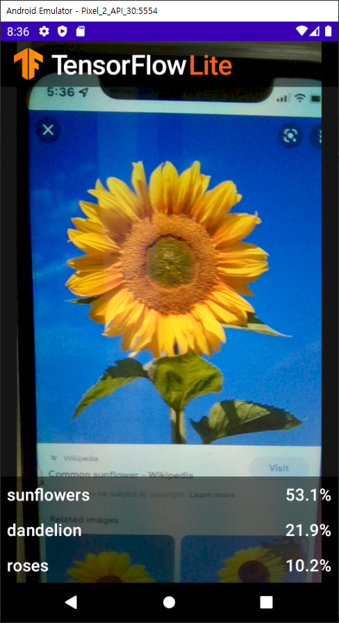
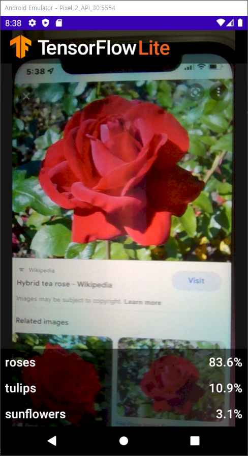

# 🤩Recognize-Flowers-with-TFL
🔥[Recognize Flowers with TensorFlow Lite on Android](https://codelabs.developers.google.com/codelabs/recognize-flowers-with-tensorflow-on-android#0)을 참고함.🔥

## 🤟프로젝트 설명

TensorFlow Lite와 Android Studio를 사용하여 딥러닝 모델을 안드로이드 앱으로 구동시키는 방식을 알아봄.

 

## 🤟결과물

어떤 꽃인지 올바르게 추측할 수 있음을 확인함.